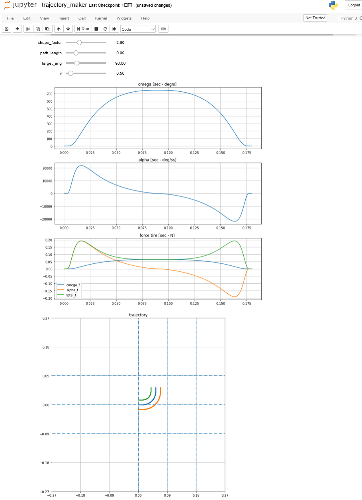

# trajectory_maker
マイクロマウスハーフ競技用のターン軌跡を弧長パラメータ付けした曲率で生成します。
スリップ角を考慮したシミュレーションにも対応しています。

## 動かし方

### binder
binderというjupyter notebookのホスティングサービスを利用  

以下のアドレスに飛び、
    
    https://mybinder.org/

GitHub repository name or URLに以下を入力しlaunchを起動
    
    GanonKuppa/trajectory_maker

ブラウザ上でjupyter notebookが立ち上がるのでtrajectory_maker.ipynbを起動  

ココから起動した方が楽かも  

### ローカル環境
以下を実行し、プログラム一式を落としてjupyter noteを起動し、trajectory_maker.ipynbを選択

    git clone https://github.com/GanonKuppa/trajectory_maker
    jupyter notebook

## ツールの概要と動作原理
ツールの概要と動作原理についてはREADME.ipynbを参照してください。

## マイクロマウス用のプログラム
もともと、trajectory_makerはマイクロマウス競技用の軌跡を作成することを目的としています。
マイクロマウス用の軌跡を作成したいときは以下のノートブックを使用して下さい。    
    - trajectory_HF_mouse_slip_angle.ipynb (ハーフ用)

ココから上記のnotebookを起動するのが手っ取り早いです。

